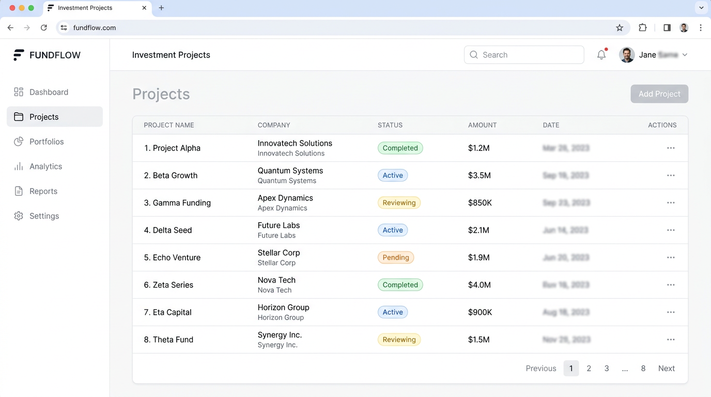
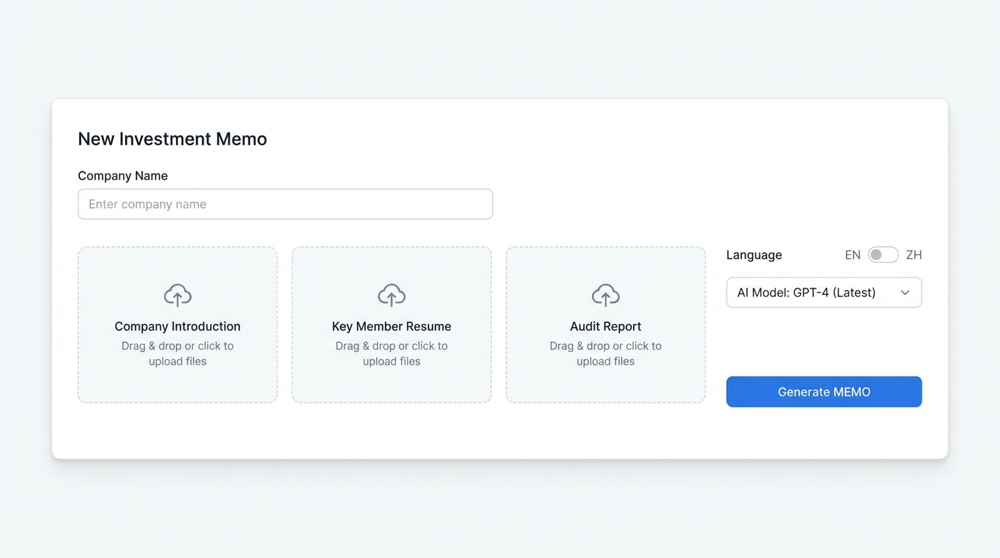
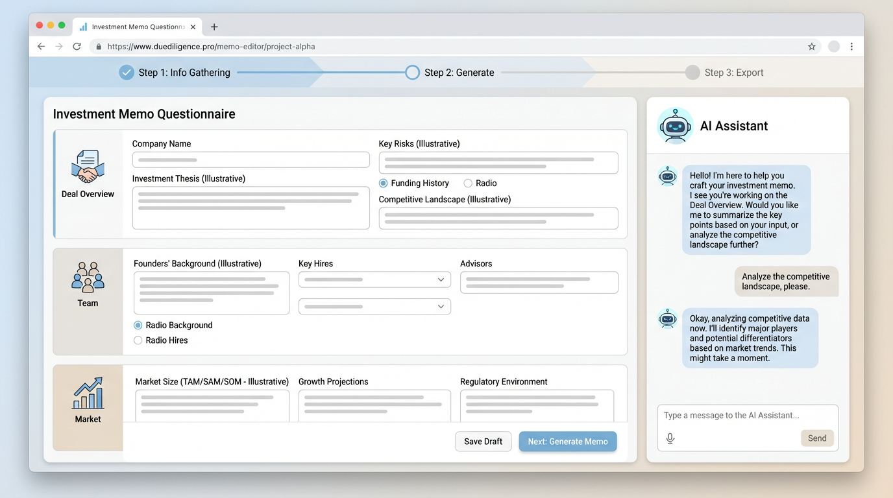

# AI Investment Memo

<p align="center">
  <strong>Turn pitch decks & diligence files into structured investment memos — with AI-assisted questionnaires, parallel generation, and an editor workflow.</strong>
</p>

<p align="center">
  
  
  
  
</p>

<p align="center">
  <a href="#-screenshots">Screenshots</a> ·
  <a href="#-features">Features</a> ·
  <a href="#-tech-stack">Tech stack</a> ·
  <a href="#-getting-started">Getting started</a> ·
  <a href="#-中文说明">中文说明</a>
</p>

---

## Screenshots

> Illustrative UI previews. Replace with your own captures in `docs/screenshots/` if you want pixel-perfect shots of your build.

| Home — project library | Create — company & categorized uploads |
| :---: | :---: |
|  |  |

| Editor — info gathering & AI assistant |
| :---: |
|  |

---

## Features

- **Project workspace** — List and manage multiple investment memo projects with stage tracking (reviewing → generating → editing).
- **Structured creation** — Company name, industry, output language (EN / 中文), and **optional** AI model selection (OpenAI-compatible providers & custom base URLs).
- **Categorized uploads** — Separate slots for *Company introduction*, *Key member resume*, and *Audit report* (all optional); supports PDF, Office formats, and text files.
- **Server-side PDF text extraction** — PDFs are parsed with [`unpdf`](https://github.com/unjs/unpdf) on the server so content is real text, not binary garbage.
- **AI information gathering** — Default DD-style questionnaire across memo sections; **parallel section pre-fill** with concurrency limits to reduce rate-limit issues.
- **Parallel memo generation** — All sections can generate in parallel (throttled); streaming updates into the editor.
- **Rich memo editor** — TipTap-based editing, section navigation, inline feedback hooks, and an AI assistant side panel.
- **Local-first persistence** — Projects and settings stored in the browser (`localStorage`); API keys stay in settings (not committed — use `.env` patterns only if you extend the app).

---

## Tech stack

| Layer | Choice |
| ----- | ------ |
| Framework | **Next.js 16** (App Router) |
| UI | **React 19**, native CSS, **TipTap** for the editor |
| State | **Zustand** |
| AI proxy | Route handlers under `/api/generate` (OpenAI-compatible streaming + provider options in code) |
| PDF | **`unpdf`** in `/api/parse-file` |
| IDs | `uuid` |

---

## Getting started

```bash
git clone https://github.com/cinderzhan/ai-investment-memo.git
cd ai-investment-memo
npm install
npm run dev
```

Open [http://localhost:3000](http://localhost:3000) (or the port shown in the terminal if `3000` is busy).

1. Open **Settings** in the app and add your API key / model (OpenAI-compatible).
2. **Create** a new memo, upload files into the categories you need, then continue to the editor workflow.

### Scripts

| Command | Description |
| ------- | ----------- |
| `npm run dev` | Development server (Turbopack) |
| `npm run build` | Production build |
| `npm run start` | Run production server |
| `npm run lint` | ESLint |

---

## Security notes

- Do **not** commit real API keys. The app stores keys in **browser localStorage** by default for local use.
- For production deployments, prefer environment-based secrets and server-only key handling.

---

## 中文说明

**AI 投资备忘录（DD Agent）**：上传商业材料（可按类型分类），用 AI 预填尽调问卷，并并发生成多章节投资备忘录，支持中英文与常见 OpenAI 兼容 API。

截图位于 `docs/screenshots/`，可自行替换为真实运行截图以便对外展示。

---

## License

This project is provided as-is for demonstration and internal tooling. Add a `LICENSE` file if you open-source it under a specific terms.
